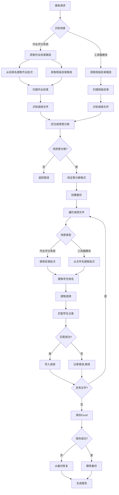

# 作业成绩写入成绩登分册设计文档

## 概述

作业成绩写入功能是一个自动化工具，用于将作业成绩文件批量写入到成绩登分册Excel文件中。系统支持两种使用场景，采用不同的处理策略：

### 使用场景

#### 1. 作业评分系统场景
在作业评分系统中，每次作业旁边有一个"登分"按钮，点击后执行批量登分：
- **触发方式**：点击作业旁边的"登分"按钮
- **输入**：作业ID（系统自动获取作业目录路径和班级信息）
- **处理逻辑**：
  - 遍历该次作业目录下的所有已评分文件
  - 从作业目录名提取作业批次（如"第1次作业" → 1）
  - 从每个文件名提取学生姓名
  - 从文档内容提取成绩
  - 定位到该课程对应班级的成绩登分册
- **输出**：将成绩写入班级目录下的成绩登分册对应列

#### 2. 工具箱模块场景
在工具箱模块中，教师手动选择班级目录进行成绩写入：
- **触发方式**：在工具箱模块中选择目录并点击"开始写入"
- **输入**：用户选择的班级目录路径（通过目录树选择器）
- **文件特点**：每个作业成绩文件是Excel汇总文件，包含该次作业所有学生的成绩
- **处理逻辑**：
  - 在选定的班级目录中查找成绩登分册（Excel文件）
  - 扫描该目录下的所有作业成绩Excel文件
  - 从每个文件名提取作业批次（如"第1次作业成绩.xlsx" → 1）
  - 打开Excel文件，从表格中读取所有学生的姓名和对应成绩
  - 对每个学生，在登分册中查找对应行
  - 根据作业批次定位到对应列
- **输出**：将所有学生的成绩写入同目录下的成绩登分册对应列

**Excel文件格式示例**：
```
| 姓名   | 成绩 |
|--------|------|
| 张三   | A    |
| 李四   | B    |
| 王五   | A    |
```

### 核心功能
- 场景识别和路由
- 作业批次智能提取（目录名或文件名）
- 作业成绩文件自动识别
- 成绩登分册文件定位
- 学生姓名智能匹配
- 成绩自动提取和写入
- 批量处理和进度跟踪
- 错误处理和事务回滚

## 架构设计

### 系统架构

```
┌─────────────────────────────────────────────────────────────┐
│                        用户界面层                              │
│  ┌──────────────┐  ┌──────────────┐  ┌──────────────┐      │
│  │ 目录选择器    │  │ 进度显示器    │  │ 结果报告器    │      │
│  └──────────────┘  └──────────────┘  └──────────────┘      │
└─────────────────────────────────────────────────────────────┘
                            │
┌─────────────────────────────────────────────────────────────┐
│                        视图层 (Views)                         │
│  ┌──────────────────────────────────────────────────────┐   │
│  │  grade_registry_writer_view()                        │   │
│  │  - 处理HTTP请求                                       │   │
│  │  - 验证用户权限                                       │   │
│  │  - 调用服务层                                         │   │
│  │  - 返回JSON响应                                       │   │
│  └──────────────────────────────────────────────────────┘   │
└─────────────────────────────────────────────────────────────┘
                            │
┌─────────────────────────────────────────────────────────────┐
│                      服务层 (Services)                        │
│  ┌──────────────────────────────────────────────────────┐   │
│  │  GradeRegistryWriterService                          │   │
│  │  - process_class_directory()                         │   │
│  │  - scan_grade_files()                                │   │
│  │  - write_grades_to_registry()                        │   │
│  └──────────────────────────────────────────────────────┘   │
└─────────────────────────────────────────────────────────────┘
                            │
┌─────────────────────────────────────────────────────────────┐
│                      工具层 (Utils)                           │
│  ┌──────────────┐  ┌──────────────┐  ┌──────────────┐      │
│  │ GradeFile    │  │ Registry     │  │ NameMatcher  │      │
│  │ Processor    │  │ Manager      │  │              │      │
│  └──────────────┘  └──────────────┘  └──────────────┘      │
└─────────────────────────────────────────────────────────────┘
                            │
┌─────────────────────────────────────────────────────────────┐
│                      数据访问层                               │
│  ┌──────────────┐  ┌──────────────┐  ┌──────────────┐      │
│  │ Word文档读取  │  │ Excel读写     │  │ 文件系统访问  │      │
│  │ (python-docx)│  │ (openpyxl)   │  │ (os/pathlib) │      │
│  └──────────────┘  └──────────────┘  └──────────────┘      │
└─────────────────────────────────────────────────────────────┘
```

### 处理流程



## 组件设计

### 1. 视图层 (Views)

#### grade_registry_writer_view (工具箱模块)
```python
@login_required
@require_http_methods(["GET", "POST"])
def grade_registry_writer_view(request):
    """
    作业成绩写入视图（工具箱模块场景）
    
    GET: 显示目录选择界面
    POST: 执行成绩写入操作
    """
```

**职责**:
- 验证用户登录状态和权限
- 处理GET请求显示界面
- 处理POST请求执行写入
- 识别为工具箱模块场景
- 调用服务层处理业务逻辑
- 返回JSON格式的响应

#### batch_grade_to_registry (作业评分系统)
```python
@login_required
@require_http_methods(["POST"])
def batch_grade_to_registry(request, homework_id):
    """
    批量登分到成绩册（作业评分系统场景）
    
    POST: 对指定作业进行批量登分
    通过作业ID自动获取作业目录、班级目录等信息
    """
```

**职责**:
- 验证用户登录状态和权限
- 根据homework_id获取作业对象
- 从作业对象获取作业目录路径
- 从作业对象获取课程和班级信息
- 自动定位班级目录和成绩登分册
- 识别为作业评分系统场景
- 调用服务层处理业务逻辑
- 返回JSON格式的响应

**关键逻辑**:
```python
homework = Homework.objects.get(id=homework_id)
homework_dir = homework.get_directory_path()  # 作业目录
course = homework.course
class_dir = course.get_class_directory()  # 班级目录
```

### 2. 服务层 (Services)

#### GradeRegistryWriterService

```python
class GradeRegistryWriterService:
    """作业成绩写入服务"""
    
    SCENARIO_GRADING_SYSTEM = "grading_system"
    SCENARIO_TOOLBOX = "toolbox"
    
    def __init__(self, user, tenant, scenario):
        self.user = user
        self.tenant = tenant
        self.scenario = scenario
        self.logger = logging.getLogger(__name__)
    
    def process_grading_system_scenario(self, homework_dir_path, class_dir_path, homework_number):
        """处理作业评分系统场景"""
        
    def process_toolbox_scenario(self, class_dir_path):
        """处理工具箱模块场景"""
        
    def scan_grade_files(self, directory):
        """扫描作业成绩文件"""
        
    def find_grade_registry(self, directory):
        """查找成绩登分册文件"""
        
    def write_grades_to_registry(self, grade_files, registry_path, homework_number=None):
        """将成绩写入登分册"""
```

**职责**:
- 识别和路由不同场景
- 协调整个写入流程
- 管理事务和备份
- 处理批量操作
- 生成处理报告

### 3. 工具类 (Utils)

#### GradeFileProcessor

```python
class GradeFileProcessor:
    """作业成绩文件处理器"""
    
    @staticmethod
    def extract_student_name(file_path):
        """从文件名提取学生姓名（作业评分系统场景）"""
        
    @staticmethod
    def extract_homework_number_from_path(dir_path):
        """从目录路径提取作业批次（作业评分系统场景）"""
        
    @staticmethod
    def extract_homework_number_from_filename(file_path):
        """从文件名提取作业批次（工具箱模块场景）"""
        
    @staticmethod
    def extract_grade_from_word(file_path):
        """从Word文档提取单个学生成绩（作业评分系统场景）"""
        
    @staticmethod
    def extract_grades_from_excel(file_path):
        """从Excel文件提取所有学生成绩（工具箱模块场景）
        
        Args:
            file_path: Excel文件路径
            
        Returns:
            List[Dict]: [{"name": "张三", "grade": "A"}, ...]
        """
        
    @staticmethod
    def is_lab_report(file_path):
        """判断是否为实验报告（仅用于Word文档）"""
```

#### RegistryManager

```python
class RegistryManager:
    """成绩登分册管理器"""
    
    def __init__(self, registry_path):
        self.registry_path = registry_path
        self.workbook = None
        self.worksheet = None
        
    def load(self):
        """加载Excel文件"""
        
    def validate_format(self):
        """验证格式"""
        
    def find_student_row(self, student_name):
        """查找学生行"""
        
    def find_or_create_homework_column(self, homework_number):
        """查找或创建作业列"""
        
    def write_grade(self, row, col, grade):
        """写入成绩"""
        
    def save(self):
        """保存文件"""
        
    def create_backup(self):
        """创建备份"""
        
    def restore_from_backup(self):
        """从备份恢复"""
```

#### NameMatcher

```python
class NameMatcher:
    """学生姓名匹配器"""
    
    @staticmethod
    def exact_match(name, name_list):
        """精确匹配"""
        
    @staticmethod
    def fuzzy_match(name, name_list):
        """模糊匹配"""
        
    @staticmethod
    def normalize_name(name):
        """规范化姓名"""
```

## 数据模型

### 处理结果数据结构

```python
{
    "success": True,
    "summary": {
        "total_files": 20,
        "success_count": 18,
        "failed_count": 2,
        "skipped_count": 0
    },
    "details": {
        "success": [
            {
                "file": "张三_作业1.docx",
                "student": "张三",
                "homework": 1,
                "grade": "A"
            }
        ],
        "failed": [
            {
                "file": "李四_作业1.docx",
                "error": "未找到学生记录"
            }
        ],
        "skipped": []
    },
    "registry_path": "/path/to/成绩登分册.xlsx"
}
```

### 成绩登分册格式

```
| 姓名   | 学号      | 第1次作业 | 第2次作业 | 第3次作业 | ...
|--------|-----------|-----------|-----------|-----------|
| 张三   | 20210001  | A         |           |           |
| 李四   | 20210002  |           | B         |           |
```

## 接口设计

### HTTP API

#### POST /grading/grade-registry-writer/ (工具箱模块)

**请求参数**:
```json
{
    "class_directory": "/path/to/class/directory",
    "repository_id": 123
}
```

**响应**:
```json
{
    "success": true,
    "message": "成绩写入完成",
    "data": {
        "summary": {...},
        "details": {...}
    }
}
```

#### POST /grading/homework/{homework_id}/batch-grade-to-registry/ (作业评分系统)

**URL参数**:
- `homework_id`: 作业ID

**请求参数**:
```json
{}
```
（无需额外参数，系统根据homework_id自动获取所需信息）

**响应**:
```json
{
    "success": true,
    "message": "批量登分完成",
    "data": {
        "homework_number": 1,
        "homework_name": "第1次作业",
        "class_name": "计算机科学1班",
        "summary": {...},
        "details": {...}
    }
}
```

**错误响应**:
```json
{
    "success": false,
    "error": "错误信息",
    "code": "ERROR_CODE"
}
```

## 错误处理策略

### 错误类型

1. **路径验证错误**
   - 路径不存在
   - 路径包含非法字符
   - 路径不在允许范围内

2. **文件访问错误**
   - 文件不存在
   - 权限不足
   - 文件被占用

3. **格式错误**
   - 登分册格式不正确
   - Word文档损坏
   - 成绩格式无效

4. **匹配错误**
   - 学生姓名未找到
   - 多个匹配结果
   - 作业次数无法识别

### 错误处理原则

- **继续处理**: 单个文件失败不影响其他文件
- **详细记录**: 记录所有错误信息和上下文
- **事务回滚**: 保存失败时从备份恢复
- **友好提示**: 向用户提供清晰的错误信息

## 测试策略

### 单元测试

- `test_extract_student_name()`: 测试姓名提取
- `test_extract_homework_number()`: 测试作业次数提取
- `test_extract_grade()`: 测试成绩提取
- `test_name_matching()`: 测试姓名匹配
- `test_registry_operations()`: 测试登分册操作

### 集成测试

- `test_full_workflow()`: 测试完整流程
- `test_error_recovery()`: 测试错误恢复
- `test_concurrent_access()`: 测试并发访问

### 测试数据

- 创建测试班级目录
- 准备测试用Word文档
- 准备测试用Excel登分册
- 模拟各种错误场景

## 性能优化

### 优化策略

1. **批量读取**: 一次性读取所有文件列表
2. **延迟加载**: 按需加载Word文档内容
3. **缓存机制**: 缓存登分册的学生列表
4. **批量写入**: 收集所有更改后一次性保存

### 性能指标

- 处理50个文件 < 30秒
- 处理200个文件 < 2分钟
- 内存占用 < 500MB

## 安全考虑

### 安全措施

1. **路径验证**: 防止路径遍历攻击
2. **权限检查**: 验证用户对文件的访问权限
3. **租户隔离**: 确保多租户数据隔离
4. **日志审计**: 记录所有操作用于审计

### 安全检查清单

- [ ] 验证所有文件路径在允许范围内
- [ ] 检查用户登录状态
- [ ] 验证用户对仓库的访问权限
- [ ] 记录所有文件访问操作
- [ ] 防止SQL注入和XSS攻击

## 部署考虑

### 依赖项

- `python-docx`: Word文档处理
- `openpyxl`: Excel文件处理
- `pandas`: 数据处理（可选）

### 配置项

```python
# settings.py
GRADE_REGISTRY_WRITER = {
    'MAX_FILES_PER_BATCH': 500,
    'BACKUP_RETENTION_DAYS': 7,
    'ALLOWED_GRADE_FORMATS': ['A', 'B', 'C', 'D', 'E', '优秀', '良好', '中等', '及格', '不及格'],
}
```

### 日志配置

```python
LOGGING = {
    'loggers': {
        'grading.grade_registry_writer': {
            'level': 'INFO',
            'handlers': ['file', 'console'],
        },
    },
}
```

## 未来扩展

### 可能的增强功能

1. **支持更多文件格式**: PDF、TXT等
2. **智能成绩识别**: 使用OCR识别手写成绩
3. **批量导出**: 导出成绩报表
4. **统计分析**: 成绩分布统计
5. **通知功能**: 完成后发送邮件通知

### 技术债务

- 考虑使用异步任务处理大批量文件
- 考虑使用消息队列处理长时间运行的任务
- 考虑添加进度WebSocket实时推送
